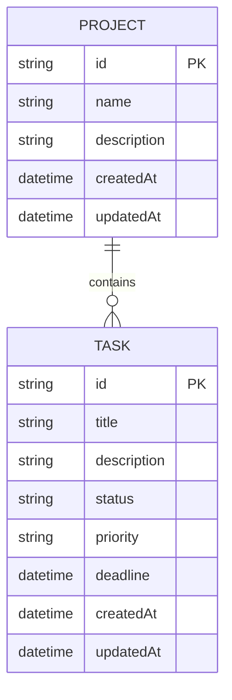

# ER Diagram

## Entities and Relationships

- **PROJECT**: Represents a task project with a list of tasks.
- **TASK**: Represents an individual task belonging to a project.
- **Relationship**: One `PROJECT` contains many `TASK` entities.
- **Notes**: `TASK.deadline` is optional in the model; `priority` is one of `low`, `medium`, `high`.
