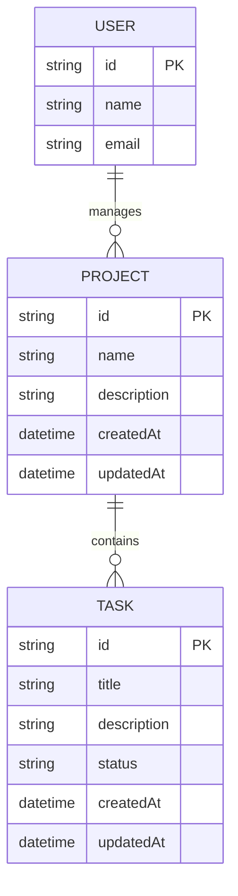

# ER Diagram

## Entities and Relationships

- **USER**: Represents a system user. One user can manage multiple projects.
- **PROJECT**: Represents a task project. One project contains multiple tasks.
- **TASK**: Represents an individual task within a project.
